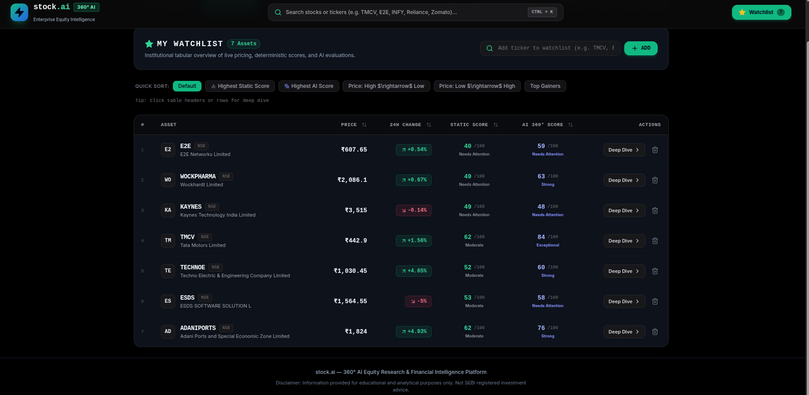
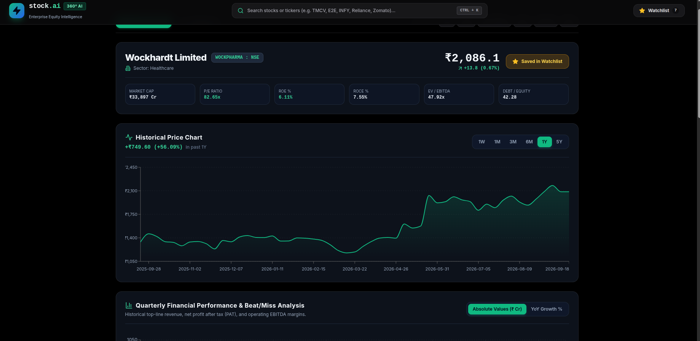
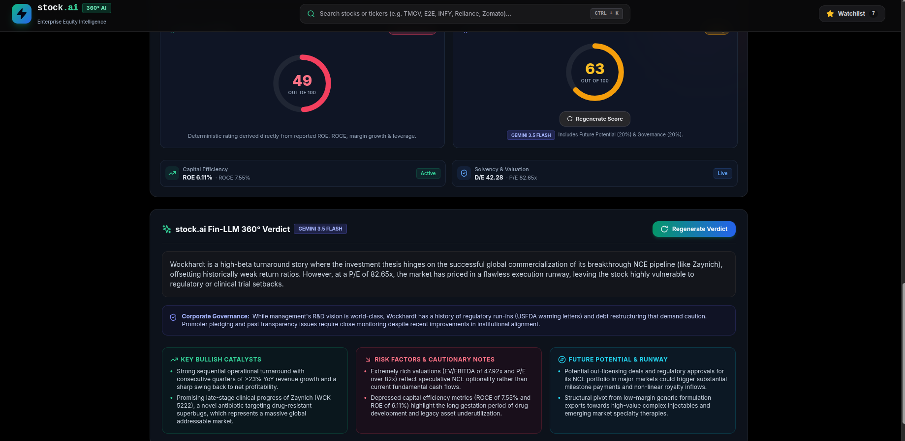

# stock.ai — 360° AI Equity Research & Financial Intelligence Platform

[](https://nodejs.org/)
[](https://react.dev/)
[](https://vitejs.dev/)
[](https://tailwindcss.com/)
[](https://sqlite.org/)
[](https://aistudio.google.com/)

**stock.ai** is an institutional-grade stock analysis and equity intelligence application built for Indian and global equities (NSE, BSE, and US exchanges). It integrates real-time price feeds, verified quarterly financial statements from Screener.in and Yahoo Finance, deterministic quantitative scoring, and multi-pillar qualitative research synthesized by **Google Gemini 3.5 Flash** with an offline heuristic fallback engine.

---

## 📸 Screenshots & Visual Walkthrough

### 1. Institutional Watchlist Table
A high-density tabular dashboard monitoring saved assets, real-time market quotes, deterministic scores, and AI evaluations with multi-column sorting.



- **One-Click Multi-Criteria Sorting**: Sort instantly by Highest Static Score, Highest AI Score, Price (High $\rightarrow$ Low, Low $\rightarrow$ High), or Top Gainers.
- **Side-by-Side Score Badges**: View pure quantitative ratings alongside qualitative AI evaluations.
- **Fast Quick-Add**: Add any ticker with live validation and auto-resolution.

---

### 2. Company 360° Deep Dive & Historical Price Chart
Comprehensive asset overview with fundamental metrics, interactive timeframe charts, and historical quarterly results.



- **Header Financial Tiles**: Real-time Market Cap, P/E Ratio, ROE %, ROCE %, EV/EBITDA, and Debt-to-Equity.
- **Timeframe Performance Indicator**: Track exact value and percentage gains across `1W`, `1M`, `3M`, `6M`, `1Y`, and `5Y` periods.
- **Quarterly Financials**: Chronologically aligned revenue, net profit (PAT), and operating margin trends across trailing quarters.

---

### 3. Dual 360° Score Matrix & Fin-LLM Research Thesis
Decoupled quantitative evaluation and qualitative research thesis with independent generation and SQLite persistence.



- **Dual 360° Gauges**:
  - **Deterministic Static Financial Score (Left)**: 100% mathematical formula grading Capital Efficiency (25%), Growth Momentum (25%), Solvency (20%), Valuation (20%), and Price Health (10%).
  - **AI 360° Qualitative Score (Right)**: Evaluated by Gemini 3.5 Flash incorporating Corporate Governance (20%) and Future Potential (20%) with a dedicated **Regenerate Score** button.
- **stock.ai Fin-LLM 360° Verdict**:
  - **Executive Research Thesis**: 2-sentence synthesis of valuation and risk-reward profile with a dedicated **Regenerate Verdict** button.
  - **Corporate Governance Assessment**: Analysis of promoter pledging, debt restructuring history, and accounting transparency.
  - **3-Pillar Research Grid**: Parallel cards for **Key Bullish Catalysts** (Emerald), **Risk Factors & Cautionary Notes** (Rose), and **Future Potential & Runway** (Cyan).

---

## ⚡ Key Features

- **Decoupled AI Architecture**: The AI 360° Score and the Fin-LLM 360° Verdict run as independent pipelines with dedicated trigger buttons and isolated persistence.
- **Persistent Local Cache**: All generated scores, verdicts, catalysts, and financial data are cached in SQLite (`equisense.db` in WAL mode). Saved analyses never disappear on page refresh or tab switching.
- **Resilient AI Fallback**: If the Google Gemini API hits a rate limit (HTTP 429 / 503) or is unconfigured, the app automatically falls back to the deterministic `stock.ai Algorithm` without crashing or freezing.
- **Institutional Design**: Dark-mode terminal palette built with Tailwind CSS, custom glow effects, and responsive desktop-to-mobile layouts.

---

## 🛠️ Tech Stack

| Layer | Technology |
|---|---|
| **Frontend** | React 18, Vite 5, Tailwind CSS, Lucide Icons |
| **Backend** | Node.js, Express 5, Axios, Cheerio |
| **Database** | SQLite (`better-sqlite3` with Write-Ahead Logging) |
| **Data Sources** | Yahoo Finance API (`yahoo-finance2`), Screener.in Web Scraper |
| **AI Engine** | Google Gemini (`gemini-3.5-flash` via Google Generative Language Interactions API) |

---

## 🚀 Getting Started

### Prerequisites
- Node.js v18.0.0 or higher
- npm or yarn

### 1. Clone the Repository
```bash
git clone https://github.com/Escanor1996/stock.ai.git
cd stock.ai
```

### 2. Install Dependencies
```bash
npm install
```

### 3. Environment Configuration
Create a `.env` file in the root directory:
```env
PORT=3001
GEMINI_API_KEY=your_google_ai_studio_api_key_here
```
> **Note**: If `GEMINI_API_KEY` is omitted, the app will automatically run using the built-in `stock.ai Algorithm` heuristic engine.

### 4. Run Development Servers
Start both the backend server (port 3001) and frontend Vite dev server (port 3000) concurrently:
```bash
npm run dev
```

Open your browser and navigate to **`http://localhost:3000`**.

---

## 📡 API Endpoints

| Method | Endpoint | Description |
|---|---|---|
| `GET` | `/api/stock/:ticker` | Returns complete stock profile (quotes, fundamentals, quarterly history, and saved AI analysis). |
| `GET` | `/api/stock/:ticker/history?range=1y` | Returns historical price series for charts (`1m`, `6m`, `1y`, `5y`). |
| `GET` | `/api/stock/:ticker/score?refresh=true` | Triggers independent AI 360° quantitative scoring across the 6 pillars. |
| `GET` | `/api/stock/:ticker/verdict?refresh=true` | Synthesizes independent Fin-LLM qualitative research thesis & 3-pillar catalysts. |
| `GET` | `/api/stock/:ticker/analysis?refresh=true` | Combined analysis endpoint (runs or retrieves cached score + verdict). |
| `GET` | `/api/search?q=:query` | Real-time ticker and company name lookup. |

---

## ⚖️ Disclaimer

Information provided by **stock.ai** is strictly for educational and analytical purposes only. It does not constitute investment advice, financial endorsement, or a recommendation to buy or sell securities. The platform is not a SEBI-registered investment advisor. Always conduct your own research before making financial decisions.
